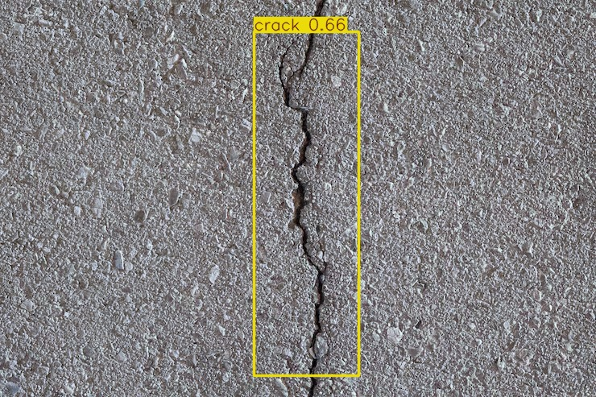
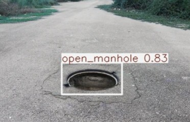

🚧 Pothole Detection System (Deep Learning + Computer Vision)

A complete end-to-end system that detects potholes from images or live video feed using a trained deep learning model. This project aims to assist municipal bodies and smart-city systems by automating road-condition monitoring.

📌 Overview

This project uses Convolutional Neural Networks (CNN) / YOLO / custom model (your choice) to detect potholes in real-time or from uploaded images.

✔️ Image-based detection
✔️ Real-time video detection (webcam / mobile)
✔️ Preprocessing & augmentation
✔️ Model training + evaluation
✔️ Easy deployment with Python/Colab

🏗️ System Architecture

Place your architecture image here

Workflow:

Data collection

Image preprocessing

Model training

Detection pipeline

Output visualization

🧠 Model Details

Model Type: YOLO 

Input Size: 224×224 or as per your model

Optimizer: Adam / RMSProp

Loss Function: Binary cross-entropy

Accuracy Achieved: XX% (fill this)

